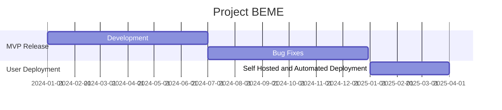

# BEAMIFY.ME: Project BEME

#### Current Roadmap

### Stage 1: MVP Release
We are currently working on providing a fully working backend and frontend solution for the MVP release.

### Stage 2: User Deployment
Our aim with this, once we have a fully working MVP, is to provide a self-hosted solution for users to deploy their own instances of BEME.
