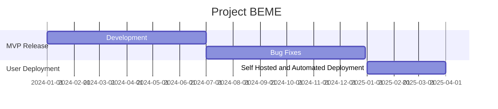

# BEAMIFY.ME: Project BEME

#### Current Roadmap

### Stage 1: MVP Release
We are currently working on providing a fully working backend and frontend solution for the MVP release.

There are a lot of **'Core Features'** that we are building.

- [x] Full User Management  
Login, Register, Forgot Password, Reset Password, Update Profile, Delete Account
- [x] User Blogging  
With everything you would expect from a blogging platform
- [x] Ecommerce with Vendor Management  
A fully functional ecommerce platform, fully stocked with products and the ability for users to create their own ecommerce.
- [x] Social Media  
A fully functional social media platform, with all the features you would expect from a social media platform.
- [x] Live Streaming  
Everything you would ever need from a live streaming platform, including push notifications, live chat, and more.

